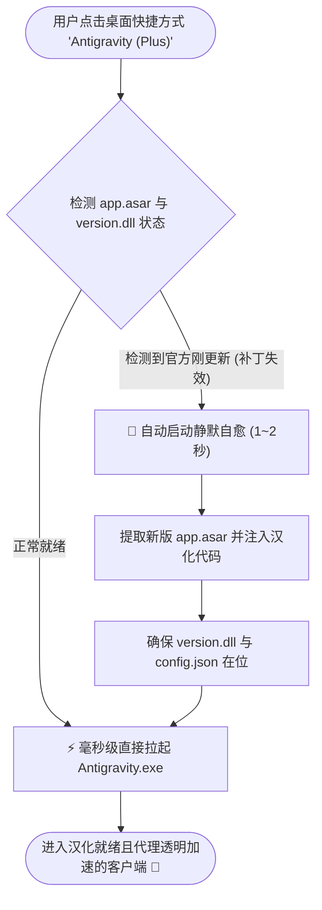

# 🚀 Antigravity-Plus

<p align="center">
  <b>一站式 Antigravity 增强套件：中文汉化 + 免 TUN 强制透明代理 + 官方更新秒级自愈</b>
</p>

<p align="center">
  <a href="#-核心特性">✨ 核心特性</a> •
  <a href="#-更新自愈原理">⚡ 更新自愈原理</a> •
  <a href="#-快速开始">📦 快速开始</a> •
  <a href="#-代理配置指南">🌐 代理配置</a> •
  <a href="#-致谢与上游">🤝 致谢与上游</a> •
  <a href="#-免责声明">📄 免责声明</a>
</p>

---

## 📖 项目简介

**Antigravity-Plus** 将两款广受欢迎的社区神器深度融合：
1. **[antigravity-desktop-cn](https://github.com/Silas-02/antigravity-desktop-cn)**：深度优化的 Antigravity 桌面端中文汉化补丁。
2. **[antigravity-proxy](https://github.com/yuaotian/antigravity-proxy)**：基于 Windows DLL 劫持与 Winsock API Hook 的免 TUN 强制 SOCKS5/HTTP 透明代理注入工具。

### 💡 彻底解决的核心痛点
以往每次 Antigravity 官方客户端静默更新升级后：
- `app.asar` 会被官方英文版本重新覆盖，**汉化瞬间失效**；
- 安装目录非官方文件可能失联，**代理拦截脱钩**；
- 用户不得不每次手动重新下载或寻找脚本重复解包安装。

**Antigravity-Plus 首创“智能自愈启动器（Smart Launcher）”架构**，在零常驻后台进程、零资源占用的前提下，每次启动客户端前毫秒级检测补丁状态。一旦官方更新覆盖，**2 秒内静默自动完成汉化重注入与代理就位**，让您始终畅享汉化与网络加速无缝体验！

---

## ✨ 核心特性

- **🛡️ 毫秒级更新自愈 (Smart Launcher)**：
  - 双击桌面快捷方式即可极速启动。
  - 启动前自动比对客户端与补丁指纹；当官方版本自动升级后，秒级静默完成补丁重打包与 DLL 维持，杜绝频繁手动重装。
- **🇨🇳 深度精准汉化**：
  - 动态多语言支持：完美汉化顶部菜单、任务栏托盘、加载界面、设置面板与核心功能。
  - 绝对安全隔离：对用户提示词对话输入（`data-testid="user-input-step"`）、代码块、终端输出严格实行白名单豁免，绝不干扰代码与提示词语义。
- **⚡ 免 TUN 强制进程代理**：
  - Windows 原生 `version.dll` 劫持注入，拦截 Winsock `connect` / `WSAConnect` 调用，强行转发到本地 SOCKS5 或 HTTP 代理。
  - 无需开启虚拟网卡/TUN 模式，绕过系统权限限制。
  - 递归注入 `language_server.exe` / `node.exe` / `agy.exe` 等核心子进程，确保网络请求 100% 顺畅。
- **🎯 纯净与配置隔离**：
  - 代理配置保持与前端解耦，保存在 `config.json` 中，更新升级绝不覆盖您的个性化端口设置。
  - 提供可视化的网页配置器 `config-web.html`，小白亦可直观调整节点与分流规则。
- **🔄 一键无损还原**：
  - 自动保留官方干净备份包 `app.asar.bak`。随时运行 `uninstall.bat`，即可秒级无损还原为官方出厂英文状态。

---

## ⚡ 更新自愈原理



1. **指纹检测**：每次启动前，启动器读取客户端 `app.asar` 中的特征签名。由于 Electron 的 ASAR 文件未压缩，检测仅需十余毫秒。
2. **安全自愈**：如果检测到文件已被官方更新器替换为新的官方原版，启动器自动将最新的原生包设为新备份基准，重新打入汉化词典与拦截逻辑，并校验 `version.dll`。
3. **平滑拉起**：自愈过程对用户几乎无感，修补后自动启动官方主程序。

---

## 📦 快速开始

### 系统要求
- **操作系统**：Windows 10 / 11 (x64)（汉化特性亦支持 macOS 与 Linux）
- **运行环境**：需安装 [Node.js](https://nodejs.org/) (推荐 LTS 版本，如 v18、v20 或更高)

### 安装步骤

1. **下载或克隆本仓库**：
   ```bash
   git clone https://github.com/TttXxx36/Antigravity-plus.git
   cd Antigravity-plus
   ```

2. **运行一键安装脚本**：
   - 双击运行根目录下的 **`install.bat`**。
   - 脚本会自动：
     - 检索系统中的 Antigravity 路径；
     - 注入最新中文多语言引擎；
     - 部署免 TUN 强制代理核心（`version.dll` 与 `config.json`）；
     - 在桌面生成 **【Antigravity (Plus)】** 智能自愈快捷方式。

3. **日常启动**：
   - 以后请直接双击桌面的 **【Antigravity (Plus)】** 快捷方式打开客户端。

---

## 🌐 代理配置指南

代理核心在首次安装时会生成默认配置文件：`config.json`（默认配置为 `socks5://127.0.0.1:7890`）。

### 方法 1：使用内置可视化配置器（推荐 ⭐⭐⭐）
双击打开客户端目录下的 `config-web.html`，在浏览器中即可使用友好的图形界面修改代理端口、模式与进程黑白名单，点击保存即可更新。

### 方法 2：直接编辑 `config.json`
在 Antigravity 安装目录（例如 `%LOCALAPPDATA%\Programs\antigravity\config.json`）中直接编辑：
```json
{
  "proxy": {
    "type": "socks5",
    "host": "127.0.0.1",
    "port": 7890
  },
  "child_injection": true,
  "target_processes": [
    "agy.exe",
    "language_server.exe",
    "Antigravity.exe",
    "node.exe"
  ]
}
```
> **提示**：如果您使用的是 Clash / Mihomo，常见默认端口为 `7890`；如果是 V2Ray / Xray，常见默认端口为 `10808`。

---

## 🛠️ 高级与维护命令

通过命令行可以灵活使用 `core/patcher.js` 提供的能力：

```bash
# 查看当前客户端补丁与代理部署状态
node core/patcher.js --status

# 执行毫秒级自愈检查（已就绪则跳过，未打补丁则修补）
node core/patcher.js --auto-heal

# 仅部署/更新代理 DLL 和配置
node core/patcher.js --deploy-proxy

# 还原回官方原生英文状态
node core/patcher.js --uninstall
```

---

## 🔄 一键卸载与还原

如果需要完全移除汉化与代理并恢复官方原版：
- 双击运行 **`uninstall.bat`**。
- 脚本会自动将官方 `app.asar.bak` 恢复为 `app.asar`，移除注入的 `version.dll`，并清理创建的桌面快捷方式。

---

## 🤝 致谢与上游

本项目是优秀的开源社区成果的集大成者，特别感谢：
- **[Silas-02/antigravity-desktop-cn](https://github.com/Silas-02/antigravity-desktop-cn)** 与 **[qqxpee/antigravity2-cn](https://github.com/qqxpee/antigravity2-cn)** 提供的精细化汉化引擎与词典生态。
- **[yuaotian/antigravity-proxy](https://github.com/yuaotian/antigravity-proxy)** 提供的优雅免 TUN 注入方案。

---

## 📄 免责声明

1. 本项目为开源爱好者自主开发的本地工具集，仅供学习、研究与个人交流使用。
2. 本项目不分发官方客户端程序本身，所有修改操作均通过本地合法解包与标准系统接口完成。
3. 请合理配置本地代理，遵守相关法律法规。
